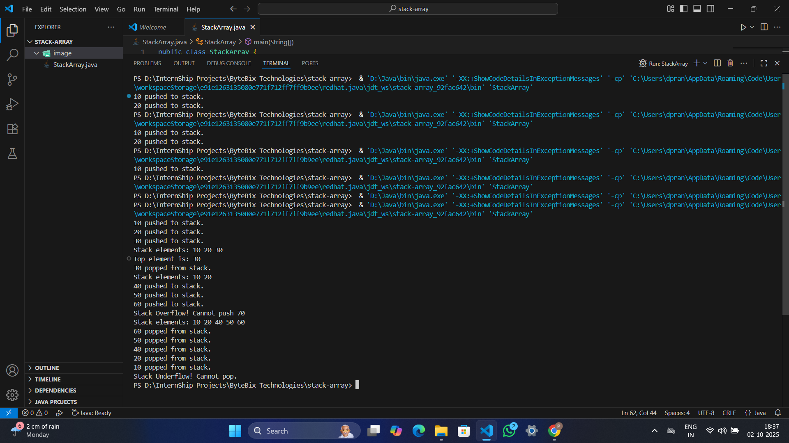

# Stack Using Array (Java)

This project implements a **stack data structure** using arrays in Java.  
It supports the following operations:
- `push`
- `pop`
- `peek`
- `isEmpty`
-
---

## 🖼 Screenshot of Program output:-
<p align="center">
  
</p>

---

## ▶️ How to Run

1. Clone this repository:
   ```bash
   git clone https://github.com/daspranay918/stack-array.git
   cd stack-array
javac StackArray.java
java StackArray

